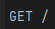

###  Anotações aula
* const http = require('http') jeito padrão, sem adicionar o type module (package.json)
* import http from 'node:http' jeito de fazer a importação com o type module (package.json), que disponibiliza a capacidade de importar e exportar no node
* Uitlizar o node: para identificar importações que são do proprio node, para o proprio saber diferenciar
* Criar um server const server = http.createServer(() =>{})
* Está passando uma arrow function nesse server
* Criar um server.listen (3333) para o servidor escutar a porta 3333
* Vai ser passado dois parametros request e response (req,res)
* Atraves do req vc vai conseguir obter o retorno de todas as informações, como por exemplo a criação de um usuário (nome, e-mail,senha)
* Res seria a resposta desse servidor

### Aula 2
* Uma requisição http é composta de dois principais recursos method e url
* Vamos obter essas duas informações através do req
*  GET (metodo method) / (url caminho que foi feito a rquisição)
* Metedos: GET = buscar um recurso no back-end | POST = Criar um recurso no back-end | PUT = Atualizar um recurso no back-end
* (Continuação de cima) PATCH = Atualizar uma informação especifica de um recurso no back-end | DELETE = Deletar um recurso do back-end